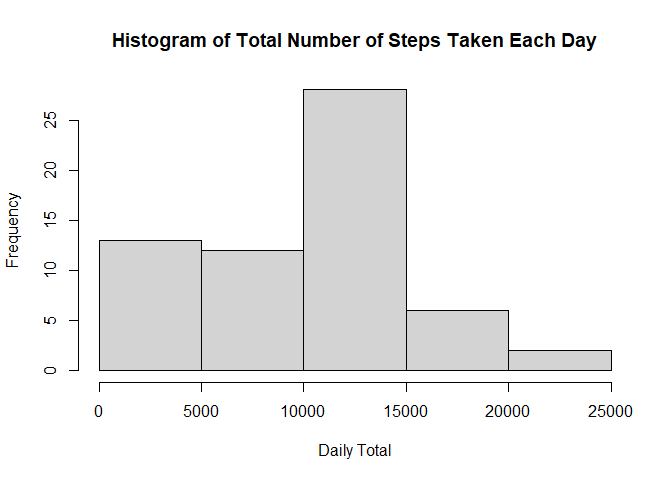
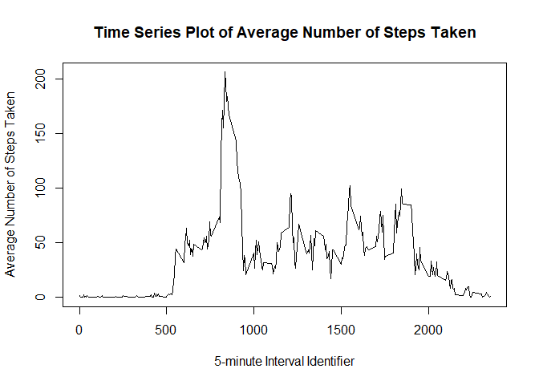
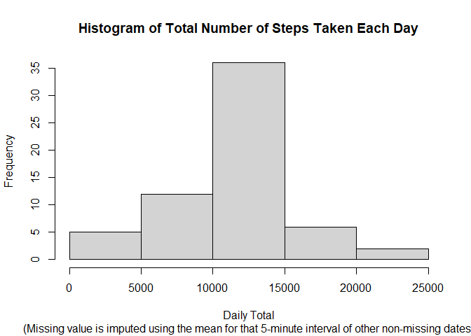
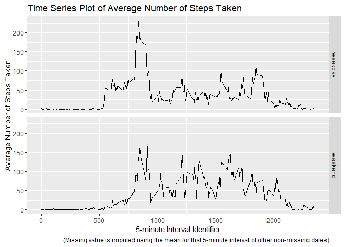

## Load needed R packages


```r
library(tidyverse)
```

```
## -- Attaching packages --------------------------------------- tidyverse 1.3.1 --
```

```
## v ggplot2 3.3.5     v purrr   0.3.4
## v tibble  3.1.1     v dplyr   1.0.6
## v tidyr   1.1.3     v stringr 1.4.0
## v readr   2.0.0     v forcats 0.5.1
```

```
## -- Conflicts ------------------------------------------ tidyverse_conflicts() --
## x dplyr::filter() masks stats::filter()
## x dplyr::lag()    masks stats::lag()
```

```r
library(lubridate)
```

```
## 
## Attaching package: 'lubridate'
```

```
## The following objects are masked from 'package:base':
## 
##     date, intersect, setdiff, union
```

## Loading and preprocessing the data

To load the activity data from zip file, below code is used. The first five observations from dataset are shown.

```r
data <- read.csv(unz("activity.zip", "activity.csv"), header=T)
data[1:5,]
```

```
##   steps       date interval
## 1    NA 2012-10-01        0
## 2    NA 2012-10-01        5
## 3    NA 2012-10-01       10
## 4    NA 2012-10-01       15
## 5    NA 2012-10-01       20
```

## What is mean total number of steps taken per day?

For this part, missing values in the dataset are ignored. 

To draw a histogram of the total number of steps taken each day: 

```r
daily <- data %>% group_by(date) %>% summarise(daily_total=sum(steps, na.rm = T))
hist(daily$daily_total, main="Histogram of Total Number of Steps Taken Each Day", xlab="Daily Total")
```

<!-- -->

To calculate the mean and median total number of steps taken per day:

```r
mean <- format(round(mean(daily$daily_total),2), scientific=F)
mean
```

```
## [1] "9354.23"
```

```r
median <- format(round(median(daily$daily_total),2), scientific=F)
median
```

```
## [1] "10395"
```
For total number of steps taken per day, the mean is 9354.23 and the median is 10395.


## What is the average daily activity pattern?

For this part, missing values in the dataset are ignored. 

To make a time series plot (i.e. type = "l") of the 5-minute interval (x-axis) and the average number of steps taken, averaged across all days (y-axis):

```r
avg <- data %>% group_by(interval) %>% summarise(avg=mean(steps, na.rm = T))
plot(avg$interval, avg$avg, type="l", xlab="5-minute Interval Identifier", ylab="Average Number of Steps Taken", main="Time Series Plot of Average Number of Steps Taken")
```

<!-- -->

To find the 5-minute interval containing the maximum number of steps on average across all the days in the dataset:

```r
max <- avg$interval[which.max(avg$avg)]
max
```

```
## [1] 835
```
So the 5-minute interval, on average across all the days in the dataset,
which contains the maximum number of steps, is the one with identifier number 835.

## Imputing missing values

There are a number of days/intervals where there are missing values (coded as NA). The presence of missing days may introduce bias into some calculations or summaries of the data.

To calculate the number of missing value records:

```r
missing <- data %>% filter(is.na(steps))
nmiss <- nrow(missing)
nmiss
```

```
## [1] 2304
```
The total number of missing values in the dataset (i.e. the total number of rows with NAs) is 2304.

To deal with missing value issue, the mean for that 5-minute interval of other non-missing dates will be used to fill in the missing value. The imputed dataset is created using below code. The first five observations from dataset are shown.

```r
imputed <- left_join(data, avg, by="interval") 
imputed$steps[which(is.na(imputed$steps))] <- imputed$avg[which(is.na(imputed$steps))]
imputed[1:5,]
```

```
##       steps       date interval       avg
## 1 1.7169811 2012-10-01        0 1.7169811
## 2 0.3396226 2012-10-01        5 0.3396226
## 3 0.1320755 2012-10-01       10 0.1320755
## 4 0.1509434 2012-10-01       15 0.1509434
## 5 0.0754717 2012-10-01       20 0.0754717
```

To make a histogram of the total number of steps taken each day using imputed dataset:

```r
imputed_daily <- imputed %>% group_by(date) %>% summarise(daily_total=sum(steps))
hist(imputed_daily$daily_total, main="Histogram of Total Number of Steps Taken Each Day", xlab="Daily Total")
title(sub="(Missing value is imputed using the mean for that 5-minute interval of other non-missing dates)")
```

<!-- -->

To calculate the mean and median total number of steps taken per day using imputed dataset:

```r
imputed_mean <- format(round(mean(imputed_daily$daily_total),2), scientific=F)
imputed_mean
```

```
## [1] "10766.19"
```

```r
imputed_median <- format(round(median(imputed_daily$daily_total),2), scientific=F)
imputed_median
```

```
## [1] "10766.19"
```
For total number of steps taken per day when missing value is imputed, the mean is 10766.19 and the median is 10766.19, which is different from the mean (9354.23) and median (10395) of non-imputed dataset. It's obvious that imputing missing data increases the estimates of the total daily number of steps.

## Are there differences in activity patterns between weekdays and weekends?

The dataset with the filled-in missing values is for this part.

Create a new factor variable (called "week") in the dataset with two levels – “weekday” and “weekend” indicating whether a given date is a weekday or weekend day. The first five observations from dataset are shown.

```r
imputed2 <- imputed %>% mutate(day=weekdays(ymd(date)))
imputed2$week[imputed2$day %in% c("Monday", "Tuesday", "Wednesday", "Thursday", "Friday")] <- "weekday"
imputed2$week[imputed2$day %in% c("Saturday", "Sunday")] <- "weekend"
imputed2$week <- as.factor(imputed2$week)
imputed2[1:5,]
```

```
##       steps       date interval       avg    day    week
## 1 1.7169811 2012-10-01        0 1.7169811 Monday weekday
## 2 0.3396226 2012-10-01        5 0.3396226 Monday weekday
## 3 0.1320755 2012-10-01       10 0.1320755 Monday weekday
## 4 0.1509434 2012-10-01       15 0.1509434 Monday weekday
## 5 0.0754717 2012-10-01       20 0.0754717 Monday weekday
```

Make a panel plot containing a time series plot (i.e. type = "l") of the 5-minute interval (x-axis) and the average number of steps taken, averaged across all weekday days or weekend days (y-axis).

```r
imputed_avg <- imputed2 %>% group_by(week,interval) %>% summarise(avg=mean(steps), .groups="keep")
g <- ggplot(imputed_avg, aes(interval, avg)) + facet_grid(week~.) + geom_line() + labs(title="Time Series Plot of Average Number of Steps Taken", x="5-minute Interval Identifier", y="Average Number of Steps Taken", caption="(Missing value is imputed using the mean for that 5-minute interval of other non-missing dates)")
g
```

<!-- -->


